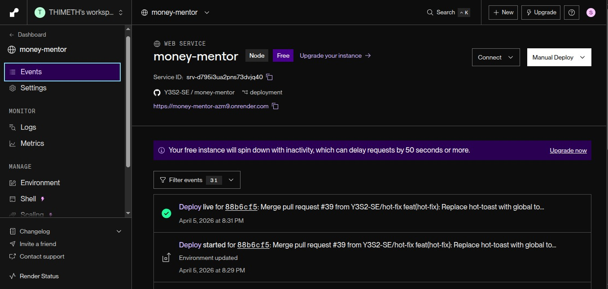
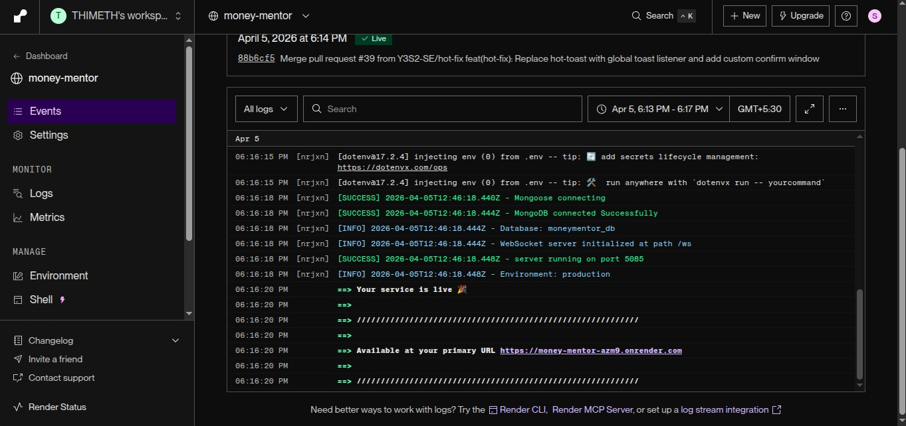
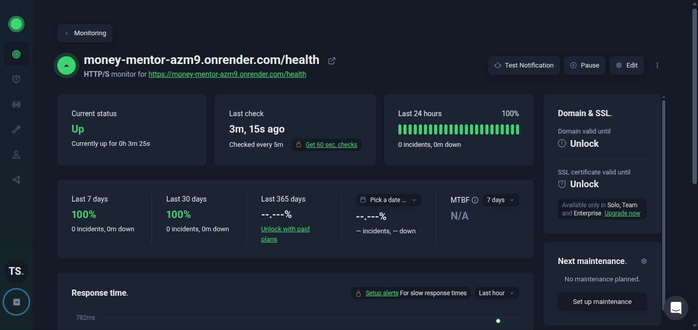
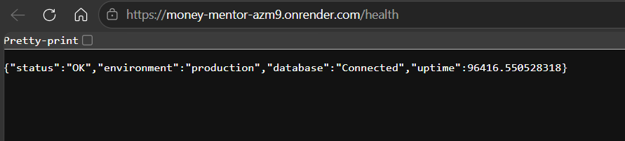
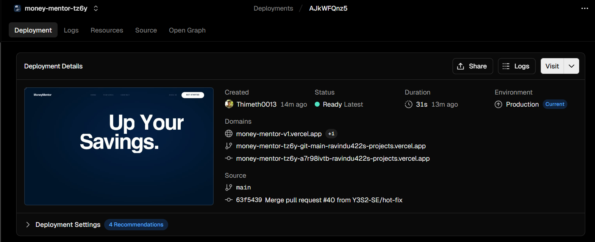
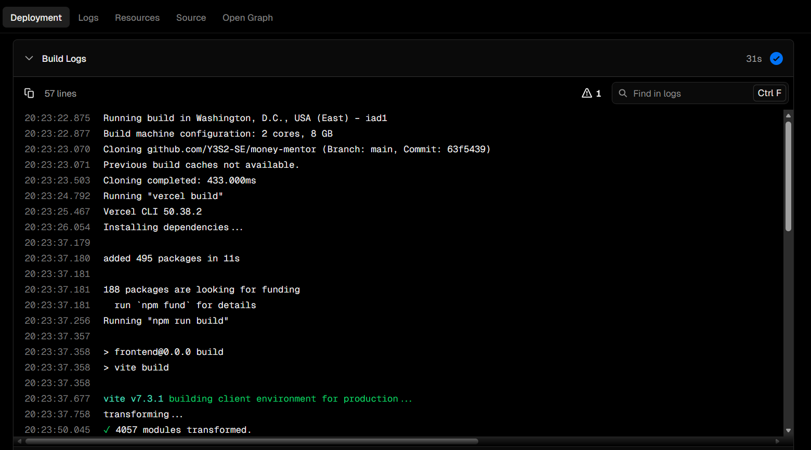
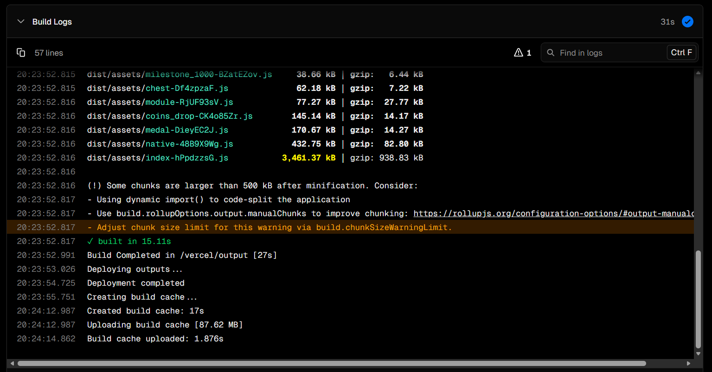

## Deployment

### 1. Backend Deployment (Render)
#### Platform: Render
- **Service Type**: Web Service
- **Runtime**: Node.js
- **URL**: https://money-mentor-azm9.onrender.com/

#### Setup steps: 
1. Push code to GitHub repository
2. Connect Render to Github account
3. Create new Web Service and select repository
4. Configure Environment:
   - **Build Command**: `npm install`
   - **Start Command**: `npm run start`
5. Add Environment Variables

   ```bash
      NODE_ENV=production
      MONGODB_URI=your_mongodb_atlas_connection_string
      JWT_SECRET=your_jwt_secret_key
      GEMINI_API_KEY=your_google_generative_ai_key
      CLOUDINARY_NAME=your_cloudinary_name
      CLOUDINARY_KEY=your_cloudinary_api_key
      CLOUDINARY_SECRET=your_cloudinary_secret
      EXCHANGE_API_KEY=your_fawazahmed0_api_key
      FRONTEND_URL=https://money-mentor-v1.vercel.app
      ALLOWED_ORIGINS=https://money-mentor-v1.vercel.app
   ```

6. Deploy and monitor logs

---
### 2. Frontend Deployment (Vercel)

#### Platform: Vercel
- **Framework**: React (Vite)
- **URL**: https://money-mentor-v1.vercel.app/

#### Setup Steps:
1. Connect GitHub repository to Vercel
2. Select `frontend` directory as root
3. Configure Build Settings:
   - **Build Command**: `npm run build`
   - **Output Directory**: `dist`
4. Add Environment Variables:

   ```bash
     VITE_API_BASE_URL=https://money-mentor-azm9.onrender.com/api
     VITE_WS_URL=wss://money-mentor-azm9.onrender.com
   ```
5. Deploy automatically on push to main branch

---

### 3. Live URLs
| Component | URL | Status |
|-----------|-----|--------|
| Backend API | https://money-mentor-azm9.onrender.com | ✅ Active |
| Frontend App | https://money-mentor-v1.vercel.app | ✅ Active |
| Health Check | https://money-mentor-azm9.onrender.com/health | ✅ Active |

---

### Deployment Evidence

#### 1. Backend with Render

- Successful backend deployment

 
 

 - Server uptime logs


 


 - Cron Job with UptimeRobot

 


 - Server Health Check in Production Environment

 

---

 #### 2. Frontend with Vercel


 - Successful frontend deployment

 


 - Vercel Build logs

 
 
 