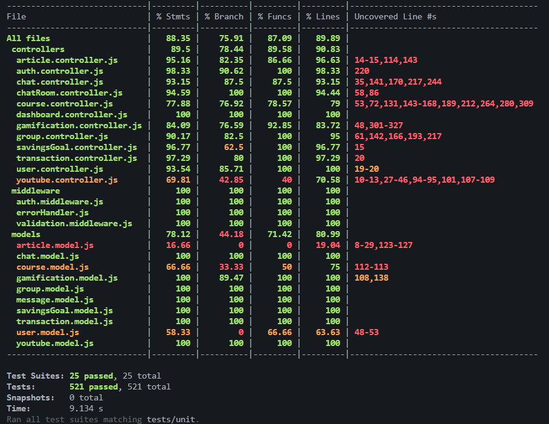
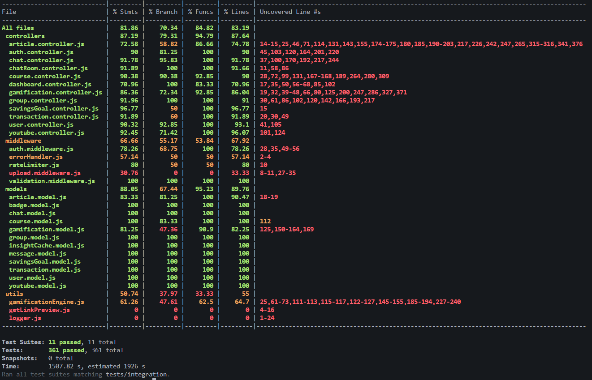
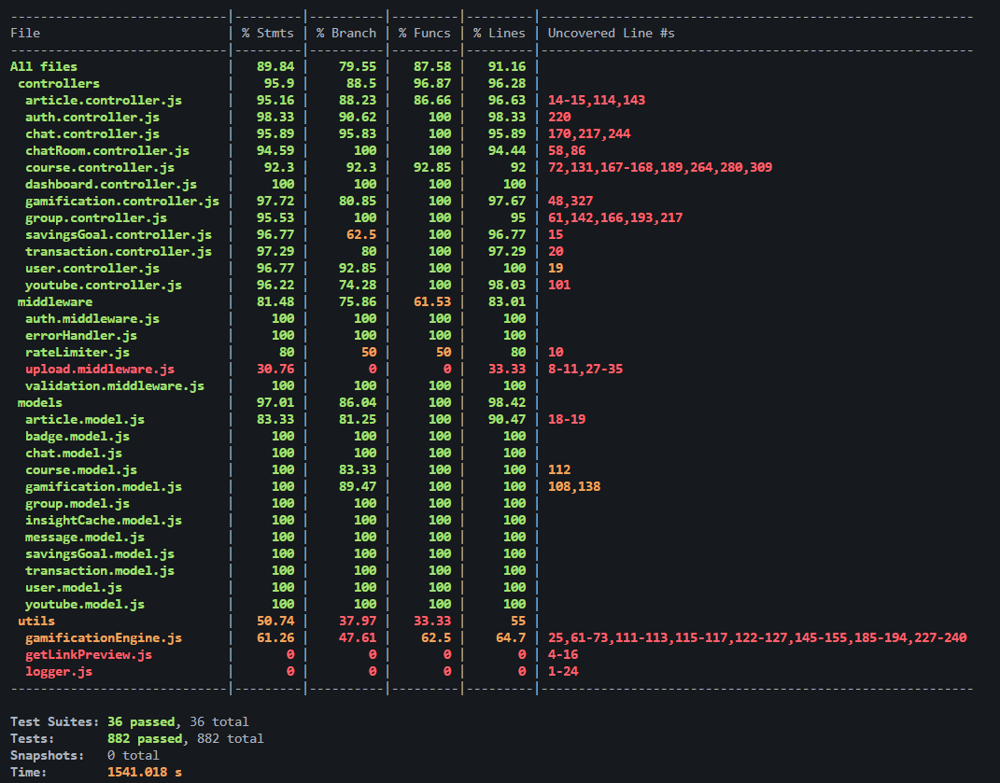

## Testing Report for Unit, Integration and Performance Testings

### 1. Complete Tests Execution (Unit + Integration)
```bash
   # change the directory to backend
      cd backend

   # Run all unit tests with coverage
      npm run test
```

**Reports generated in** `backend/coverage` **directory with HTML visualization at** `coverage/lcov-report/index.html`

---

### 2. Unit Tests

#### **Running Unit Tests**
   ```bash
   # change the directory to backend
      cd backend

   # Run all unit tests with coverage
      npm run test:unit

   # Run specific test file
      npm run test .tests/unit/models/course.model.test.js
   ```
---

### 3. Integration Tests

#### **Running Integration Tests**
```bash
# change the directory to backend
   cd backend

# Run specific integration test with coverage
   npm run test:integration 
```

#### **Integration Test Setup**
- **Database:** Test database runs on MongoDB (separate from production)
- **Environment:** Uses .env.test configuration
- **Isolation:** Database auto-resets between test suites via jest.setup.js
- **API Testing:** Uses Supertest for HTTP assertions

#### **Test Coverage by Module**
- **Authentication:** Register, login, profile management, password changes
- **Gamification:** XP system, daily streaks, leaderboard, badges
- **Transactions:** Income/expense CRUD, filtering, pagination
- **Courses:** Create, update, submit, automatic grading
- **Chat:** Conversation management, message persistence
- **Groups:** Creation, membership, real-time messaging
- **Dashboard:** Analytics, savings goals, currency conversion

#### **Testing Environment Configuration**
- .env.test File in backend directory

```bash
   NODE_ENV=test
   PORT=5085
   MONGODB_URI=mongodb://localhost:27017/test_db
   JWT_SECRET=test_secret_key_12345
   JWT_EXPIRE=1h
   ALLOWED_ORIGINS=http://localhost:5173
```
#### **Jest Configuration**
 - Key settings in jest.config.js:
   - Test Environment: Node
   - Test Timeout: 10000ms for integration tests
   - Coverage Paths: All files except node_modules and tests
   - Setup File: jest.setup.js handles database setup/teardown

### 4. Performance Tests

#### **Overview**
Performance testing validates that the application meets response time and throughput requirements under various load conditions using Artillery load testing tool.

#### **i. Testing Environment Configuration**
- Create .env.performance File in backend directory with these variables
- Performance testing database completly isolated with production database

```bash
   PORT=5081
   NODE_ENV=performance 
   PERF_DB_TARGET=docker
   MONGODB_DOCKER_URI=mongodb://localhost:27017/perf_test_db
   MONGODB_URI=mongodb+srv://<username>:<password>@cluster0.mjktxbs.mongodb.net/perf_test_db
   JWT_SECRET=add_secret_key
   JWT_EXPIRE=7d
   ALLOWED_ORIGINS=http://localhost:5081
```

#### **ii. Running Performance Tests**

**Step 1: Seed Performance Test Data with Mongo 7 Docker Image or Atlas cluster**

- **for Docker Image approach, need to have installed docker desktop**
- **After installing docker desktop,**

```bash
#  run this command to pull docker image in terminal
docker run -d -p 27017:27017 --name mongo-perf mongo:7
```

```bash 
# 1. Open a terminal and run 
cd backend

# 2. Then Load test data with multiple users and resources 

npm run perf:seed:atlas  # for Atlas Conncetion

npm run perf:seed:docker # or Docker Image

# 3. In same terminal, Start server with performance environment configuration

npm run perf:seed:atlas # for Atlas Conncetion

npm run perf:start:docker # or Docker Image
```
- **While server is running in that terminal, Follow these steps**

```bash
# 4. Open a new terminal in backend directory
cd backend

# 5. Run the load test scenarios that have in artillery.config.yml
npm run perf:run:atlas # for Atlas Conncetion

npm run perf:run:docker # or Docker Image
```

- **After test completed, then we can generate HTML and enhanced report** 
```bash
#. For that use this command in backend directory
npm run perf:report:docker # for Atlas Conncetion

npm run perf:report:atlas # or Docker Image
```

#### **iii. Test Configuration**
- Load Testing Phases `artillery.config.yml`:

| Phase            | Duration | Arrival Rate   | Purpose                     |
|------------------|----------|----------------|-----------------------------|
| Warm-up          | 45s      | 1 req/s        | Initial stabilization       |
| Ramp Up          | 90s      | 1 → 10 req/s   | Gradual load increase       |
| Sustained Load   | 180s     | 12 req/s       | Normal production load      |
| Spike            | 45s      | 20 req/s       | Peak load handling          |
| Cool Down        | 45s      | 5 req/s        | Recovery phase              |

#### **iv.Performance Thresholds (SLAs):**

- `p95` Response Time: < 2000ms (95th percentile)
- `p99` Response Time: < 5000ms (99th percentile)
- `HTTP` Timeout: 20 seconds

#### **v. Test Scenarios**

| Scenario                         | Weight | Purpose                    | Operations                                  |
|----------------------------------|--------|----------------------------|---------------------------------------------|
| Auth - Login                     | 5%     | Authentication throughput  | Login flow with token capture               |
| Auth - Register & Profile        | 2%     | New user registration      | Register + profile retrieval                |
| Transactions - Read Heavy        | 25%    | Query performance          | Fetch all, income, expense transactions     |
| Transactions - Create & Read     | 15%    | Write + read operations    | Create transaction, fetch updated list      |
| Dashboard - Analytics            | 20%    | Complex aggregations       | Summary, trends, category breakdown         |
| Courses - Browse & Submit        | 15%    | Course interactions        | List, get by ID, submit & grade             |
| Chat & Groups                    | 10%    | Real-time features         | Send message, group operations              |
| Articles & YouTube               | 8%     | Content discovery          | Article list, video suggestions             |

#### **vi. Performance Test Setup**
- **Target Server:** `http://localhost:5081`
- **Environment:** Uses .env.performance configuration
- **Test Data:** Pre-seeded via seed-data.json with realistic data volumes
- **Helper Functions:** Custom processors in processors/helpers.cjs for:
   - Random user selection from seed database
   - Dynamic data generation (dates, unique emails)
   - Token management for authenticated requests
   - Course/Article/User ID randomization

#### **vii. Reports Generated**
- Performance test execution generates reports in `tests/performance/reports/`:

| Report       | Format | Contents                                      |
|--------------|--------|-----------------------------------------------|
| `report.json`  | JSON   | Raw metrics, response times, error rates      |
| `report.html`  | HTML   | Visual dashboard with charts and insights     |


----


### 5. CI/CD Pipeline
- **Automated testing runs on GitHub Actions (`backend-test.yaml`):**
- **Triggered on push to main and pull requests**
- **Runs all unit tests with coverage report**
- **Fails if any unit test unable to pass.**

---

### 6. Test Coverage Summary

#### i. Unit Tests — Models

| Test Suite | File | Type | Tests |
|------------|------|------|-------|
| Article Model | `article.model.test.js` | Unit | Default values, schema validation, wordCount & readTime auto-calculation, completions, anti-gaming logic, ObjectId |
| Chat Model | `chat.model.test.js` | Unit | Creation, defaults, message roles, content trim, keyword storage |
| Course Model | `course.model.test.js` | Unit | Creation, defaults, question validation, option count, `totalPoints` calculation, completions |
| Gamification Model | `gamification.model.test.js` | Unit | `getLevelFromXP`, `getTitleForLevel`, `awardXP`, `updateStreak`, `awardBadge`, `levelProgress` virtual |
| Group Model | `group.model.test.js` | Unit | Creation, members, admin ref, invite code, timestamps, validation |
| Message Model | `message.model.test.js` | Unit | Group reference, sender reference, content, type, readBy array, deletedAt, timestamps |
| SavingsGoal Model | `savingsGoal.model.test.js` | Unit | Required fields, monthlyGoal validation (min, negative, zero), month format (YYYY-MM), userId ObjectId, compound unique index (userId + month) |
| Transaction Model | `transaction.model.test.js` | Unit | Required fields, type enum (`income`/`expense`), amount validation (min, negative, zero), defaults, indexes (userId, date, compound) |
| User Model | `user.model.test.js` | Unit | `toAuthJSON`, `comparePassword`, defaults, field assignments |
| Youtube Model | `youtube.model.test.js` | Unit | Creation, keyword normalization, video field defaults, staleness logic |

#### ii. Unit Tests — Controllers

| Test Suite | File | Type | Tests |
|------------|------|------|-------|
| Article Controller | `article.controller.test.js` | Unit | `createArticle`, `getAllArticles`, `getArticleById`, `deleteArticle`, `getUserReadPoints` (model mocked) |
| Auth Controller | `auth.controller.test.js` | Unit | `register`, `login`, `getProfile`, `updateProfile`, `changePassword`, `logout` (model mocked) |
| Chat Controller | `chat.controller.test.js` | Unit | `startConversation`, `sendMessage`, `getAllConversations`, `getConversation`, `deleteConversation` (Gemini & model mocked) |
| ChatRoom Controller | `chatRoom.controller.test.js` | Unit | `getWsTicket`, `getMessageHistory`, `deleteMessage` (model mocked) |
| Course Controller | `course.controller.test.js` | Unit | `createCourse`, `getAllCourses`, `getCourseById`, `deleteCourse`, `submitCourse`, `getUserPoints` (model mocked) |
| Dashboard Controller | `dashboard.controller.test.js` | Unit | `getSummary`, `getCategoryBreakdown`, `getMonthlyTrends`, `getFinancialInsight`, `getRecentTransactions`, `convertCurrency` (service mocked) |
| Gamification Controller | `gamification.controller.test.js` | Unit | `getMyProfile`, `dailyLogin`, `awardXP`, `getLeaderboard` (model & engine mocked) |
| Group Controller | `group.controller.test.js` | Unit | `createGroup`, `joinGroup`, `leaveGroup`, `getUserGroups`, `getGroupById`, `deleteGroup`, `removeMember`, `updateGroup`, `regenerateInviteCode` (model mocked) |
| SavingsGoal Controller | `savingGoal.controller.test.js` | Unit | `createSavingsGoal`, `getSavingsGoal`, `updateSavingsGoal`, `getSavingsGoalProgress` (service mocked) |
| Transaction Controller | `transaction.controller.test.js` | Unit | `createTransaction`, `getTransactions`, `getTransactionById`, `updateTransaction`, `deleteTransaction` (service mocked) |
| User Controller | `user.controller.test.js` | Unit | `getAllUsers`, `getUserByID`, `deleteUser` (model mocked) |
| YouTube Controller | `youtube.controller.test.js` | Unit | `getVideoSuggestions` — chatId validation, ownership, empty keywords, cache check (model mocked) |

#### iii. Unit Tests — Middleware

| Test Suite | File | Type | Tests |
|------------|------|------|-------|
| Auth Middleware | `auth.middleware.test.js` | Unit | `protect` — valid token, missing token, invalid/expired token, user not found, deactivated account; `authorize` — role allow/deny |
| Error Handler Middleware | `errorHandler.middleware.test.js` | Unit | `notFound` — 404 with URL; `errorHandler` — status code passthrough, default 500, error message |
| Validation Middleware | `validation.middleware.test.js` | Unit | Pass, fail, multiple error formatting |

#### iv. Integration Tests

| Test Suite | File | Type | Tests |
|------------|------|------|-------|
| Article Endpoints | `article.integration.test.js` | Integration | Create (admin/user/unauth), list (all vs published, isRead flag), get by ID (draft access), update, delete, complete article (points, anti-gaming, duplicate prevention), my-points |
| Auth Endpoints | `auth.integration.test.js` | Integration | Register, login, profile, update, change password, logout |
| ChatRoom Endpoints | `chatRoom.integration.test.js` | Integration | WebSocket ticket, message history (pagination, member access control, soft-delete filtering), delete message (owner, admin, unauthorized) |
| Chat Endpoints | `chat.integration.test.js` | Integration | Start conversation, send message, list chats, get by ID, delete, ownership checks, Gemini mocked |
| Course Endpoints | `course.integration.test.js` | Integration | Create, list with filters/pagination, get by ID, update, delete, submit & grade, points award, duplicate submission prevention |
| Dashboard Endpoints | `dashboard.integration.test.js` | Integration | Summary (income/expense/savings, user isolation, month filter), category breakdown, monthly trends, recent transactions (limit 5, sort desc), currency conversion, savings goal CRUD (create, get, update, conflict, 404), savings goal progress (achieved, partial, overspend warning) |
| Gamification Endpoints | `gamification.integration.test.js` | Integration | Profile, daily login, award XP, leaderboard, badges, admin stats |
| Group Endpoints | `group.integration.test.js` | Integration | Create group, join, leave, get group details, delete group, remove member, update group, regenerate invite code |
| Transaction Endpoints | `transaction.integration.test.js` | Integration | Income/expense CRUD, field validation, user isolation, type/category/date/month/year filtering, pagination, sorted results |
| User Endpoints | `user.integration.test.js` | Integration | Get all users (pagination, search, filter by active/role), get by ID, delete, self-deletion prevention, admin-only access |
| YouTube Endpoints | `youtube.integration.test.js` | Integration | Video search, cache hit/miss, staleness check, deduplication, keyword-based fetch |


### 7. Test Environment
Tests use a separate `.env.test` file pointing to a dedicated test database (`test_db`). The database is dropped and recreated between test suites automatically via `testSetup.js`.

### 8. Test Statistics

**Total Test Files:** 36
- **Unit Tests:** 25 files (12 controllers + 3 middleware + 10 models)
   - **Statement Coverage (%)**: `88.35`
   - **Branch Coverage (%)**: `75.91`
   - **Functions (%)**: `87.09`
   - **Lines (%)**: `89.89`
- **Integration Tests:** 11 files (API endpoints)

- **Setup Files:** 3 files
   
   | File | Location | Purpose |
   |------|----------|---------|
   | `jest.unit.config.js` | `tests/setup/` | Global Jest configuration & hooks for unit test |
   | `jest.setup.js` | `tests/setup/` | Global Jest configuration & hooks |
   | `testSetup.js` | `tests/setup/` | Database setup, teardown, test utilities |

## Coverage Reports

### i. Unit Test



### ii. Integration Test



### iii. Overall Test (Unit + Integration)

